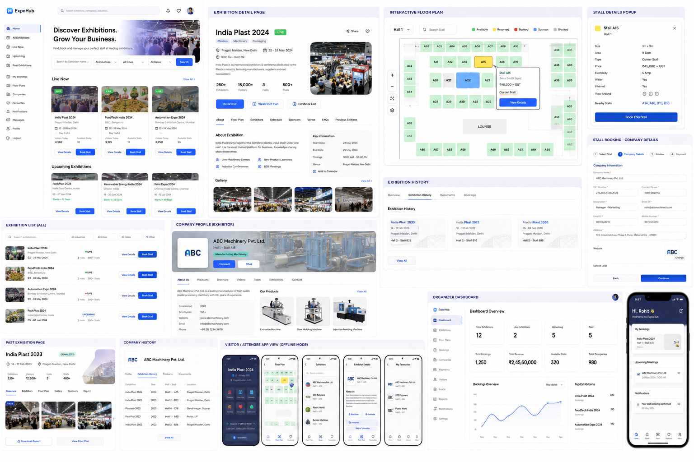

# Expo Mela — Exhibition & Stall Booking Platform

> expomela.com

A full, BookMyShow-style platform for **discovering exhibitions and booking stalls in real time**, with an interactive floor plan, role-based auth (Visitor / Exhibitor / Organizer-Admin), and an organizer analytics dashboard.

Built with **React (Vite + TypeScript + Tailwind)** on the frontend and an **Express API backed by Turso (libSQL)**. It runs 100% out of the box against a local libSQL file, and switches to a **live Turso database** the moment you add credentials.



---

## Tech stack

| Layer     | Tech                                                        |
| --------- | ----------------------------------------------------------- |
| Frontend  | React 18, Vite, TypeScript, Tailwind CSS, React Router      |
| Backend   | Node.js, Express, JWT auth, bcrypt                          |
| Database  | Turso / libSQL (`@libsql/client`) — SQLite dialect          |

---

## Quick start

```bash
# 1. Install everything (root + server + client)
npm run install:all

# 2. Seed the database with demo data (users, exhibitions, stalls, bookings)
npm run seed

# 3. Run API (:4000) + client (:5173) together
npm run dev
```

Then open **http://localhost:5173**.

> `npm run setup` does steps 1 + 2 in one go.

---

## Demo logins

| Role                | Email                   | Password  |
| ------------------- | ----------------------- | --------- |
| Organizer / Admin   | `admin@expomela.com`     | `admin123`|
| Exhibitor           | `exhibitor@expomela.com` | `demo123` |
| Visitor             | `visitor@expomela.com`   | `demo123` |

The login page has one-click buttons to auto-fill each demo account.

---

## Going live with Turso

The app uses `@libsql/client`, so the same code talks to a local file **or** a live Turso edge database.

1. Install the Turso CLI and create a database:
   ```bash
   curl -sSfL https://get.tur.so/install.sh | bash
   turso auth signup
   turso db create expohub
   turso db show expohub          # copy the libsql:// URL
   turso db tokens create expohub # copy the auth token
   ```
2. Put them in `server/.env`:
   ```env
   TURSO_DATABASE_URL=libsql://expohub-<org>.turso.io
   TURSO_AUTH_TOKEN=<your-token>
   ```
3. Re-seed against the live DB: `npm run seed`

If `TURSO_DATABASE_URL` is empty, the app falls back to `server/data/expohub.db` (a local libSQL file — the same engine Turso runs).

---

## Features

**Home (discovery)** — hero, smart search (name / industry / city), quick stats, Live / Upcoming / Past tabs, filter chips, and rich exhibition cards with live stall counts.

**Exhibition detail** — overview, organizer info, gallery, exhibitor directory, seminar schedule, FAQs, and the interactive floor plan.

**Interactive floor plan** — hall selector, colour-coded stalls (Available / Reserved / Booked / Sponsor / Blocked), stall search, stall detail panel with size/zone/price, and an instant booking flow.

**Auth** — register/login with JWT, three roles, protected routes.

**My Bookings** — every stall you've booked with reference, payment status and totals.

**Organizer dashboard** — KPI cards, top exhibitions, stall-status breakdown, recent bookings and an exhibitions management table (admin only).

---

## Project structure

```
stallbooking/
├── server/            # Express API + libSQL/Turso
│   ├── src/
│   │   ├── index.js   # API routes
│   │   ├── db.js      # Turso / local libSQL client
│   │   ├── schema.js  # tables
│   │   ├── seed.js    # demo data
│   │   └── auth.js    # JWT middleware
│   └── .env(.example)
├── client/            # React + Vite + Tailwind
│   └── src/
│       ├── pages/     # Home, ExhibitionDetail, Login, ...
│       ├── components/# Navbar, FloorPlan, ExhibitionCard, ...
│       ├── auth.tsx   # auth context
│       └── api.ts     # axios client
└── package.json       # root scripts (dev, seed, build)
```
